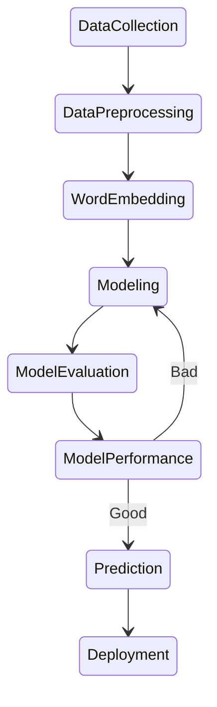

# About
This is a research work on Bangla Named Entity Recognition (NER). NER involves extracting information
from words or insight meaning of a word in text to understand their context in real-world conversations.
It’s a popular technique to extract information or categorize entities into a predefined category.
However, in Bengali, NER is challenging due to the limited availability of annotated datasets.
In this paper, we try to address this issue with pre-trained word embeddings and introduce a new [dataset](https://github.com/neon-p/bangla-ner-bilstm-with-fasttext-word2vec-embeddings/tree/master/Dataset). Our dataset includes embeddings from two widely used models: Word2vec and FastText and that are trained on accordingly 84.52 million and 1.3 billion words.
Since it is a sequence-to-sequence problem, We experiment with various neural network architectures, including CRF, LSTM, and BiLSTM, using both Word2vec and FastText embeddings. Additionally, we explore Bag of Words embeddings as a baseline.

## Dataset
We introduce the new dataset that is different from the existing Bangla NER dataset with 18731
unique tokens in a total number of 129433 tokens. The dataset consists of 16 classes and six entities in IOB2 format.
- Source: [Dataset](https://github.com/neon-p/bangla-ner-bilstm-with-fasttext-word2vec-embeddings/tree/master/Dataset)

## Workflow

## Result
| Model | F1 Micro | F1 Macro | F1 Weighted |
|----------|----------|----------|----------|
| BiLSTM+FastText   | 97.9 | 73.4 | 97.4 |
| BiLSTM+Word2Vec   | 97.7 | 61.6 | 97.6 |
